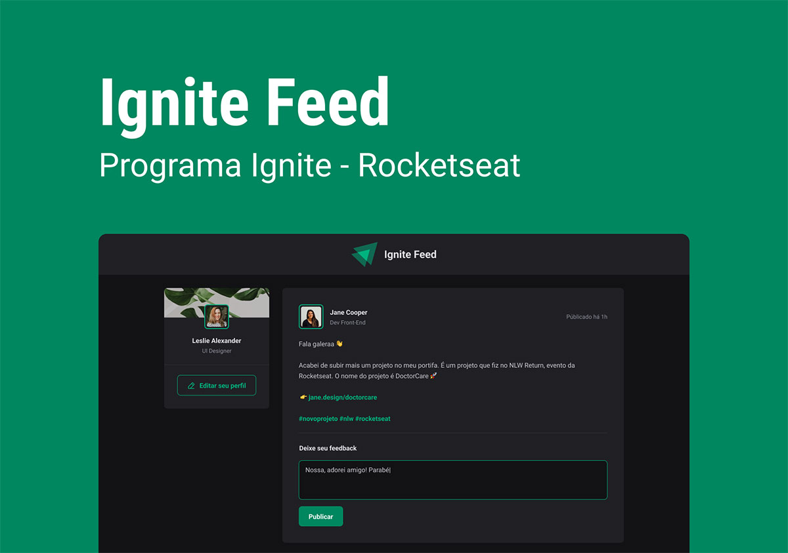

# Ignite Feed

    

O primeiro projeto desenvolvido na Trilha ReactJS do curso Ignite da RocketSeat.

## Sobre o Projeto

O `ignite-feed` é uma aplicação web construída com ReactJS, focada na criação de um feed de posts interativo com funcionalidades de comentários e likes. Este projeto serve como uma introdução prática aos conceitos fundamentais do React, desde a estruturação de componentes e estilização até o gerenciamento de estados e a manipulação de eventos.

Através das aulas do curso Ignite, a construção desta aplicação aborda os seguintes tópicos:

-   **Estrutura da Aplicação:** Organização de pastas, utilização de CSS Modules e CSS global para estilização consistente. Criação e estilização de componentes como `Header`, `Sidebar` e `Post`, seguindo um layout predefinido.
-   **Componentização:** Desenvolvimento de componentes reutilizáveis como `Avatar` e `Comment`, separando a lógica e a apresentação para melhor organização do código.
-   **Responsividade:** Implementação de técnicas para garantir que a aplicação se adapte a diferentes tamanhos de tela, incluindo dispositivos móveis.
-   **Os Motores do React:**
    -   **Iteração no JSX:** Renderização dinâmica de listas de dados utilizando o poder do JSX.
    -   **Propriedades (Props):** Comunicação e passagem de dados entre componentes pai e filho.
    -   **Estado (useState):** Gerenciamento de dados dinâmicos e reativos dentro dos componentes, controlando o comportamento e a renderização da interface.
    -   **Formulários Controlados:** Criação de formulários onde os valores dos inputs são controlados pelo estado do React.
    -   **Key:** Entendimento da importância da propriedade `key` ao renderizar listas no React.
    -   **Comunicação entre Componentes:** Compartilhamento de variáveis e funções entre diferentes partes da aplicação através de props.
    -   **Imutabilidade:** Aplicação do conceito de imutabilidade na manipulação de estados, especialmente na remoção de itens de listas.
    -   **Validação de Formulários:** Implementação de regras de validação para garantir a integridade dos dados inseridos pelos usuários.
    -   **Manipulação de Eventos (onClick):** Utilização do `useState` para implementar a lógica de likes nos comentários.
-   **Aprimorando a Aplicação com TypeScript:**
    -   Migração do projeto para TypeScript, aproveitando seus benefícios como tipagem estática e melhor segurança de código.
    -   Definição e extensão de interfaces para tipar as propriedades dos componentes, tornando o código mais explícito e prevenindo erros.

## Tecnologias Utilizadas

Este projeto foi construído utilizando as seguintes tecnologias principais:

-   **React:** Uma biblioteca JavaScript para construir interfaces de usuário interativas.
-   **TypeScript:** Um superset do JavaScript que adiciona tipagem estática, melhorando a segurança e a manutenibilidade do código.
-   **Vite:** Uma ferramenta de build extremamente rápida para aplicações web modernas.
-   **CSS Modules:** Uma técnica para escrever CSS localmente no nível do componente, evitando conflitos de nomes globais.
-   **@phosphor-icons/react:** Uma biblioteca de ícones elegantes para React.
-   **date-fns:** Uma biblioteca moderna para manipulação e formatação de datas.
-   **uuid:** Uma biblioteca para gerar IDs únicos.

## Scripts Disponíveis

No diretório raiz do projeto, você pode executar os seguintes scripts:

### `yarn dev` ou `npm run dev`

Executa a aplicação no modo de desenvolvimento, com hot-reloading para atualizações instantâneas no navegador.

### `yarn build` ou `npm run build`

Compila a aplicação para produção, otimizando os arquivos para melhor performance.

### `yarn lint` ou `npm run lint`

Executa o linter ESLint para verificar problemas de estilo e possíveis erros no código.

### `yarn preview` ou `npm run preview`

Inicia um servidor local para visualizar a build de produção da aplicação.

## Layout no Figma

[Acessar Layout no Figma](https://www.figma.com/community/file/1113573231685349036)

## Licença
Este projeto está licenciado sob a Licença MIT.

### ☕❤
[Robson H. Rodrigues](https://www.linkedin.com/in/robson-h-rodrigues-93341746/)